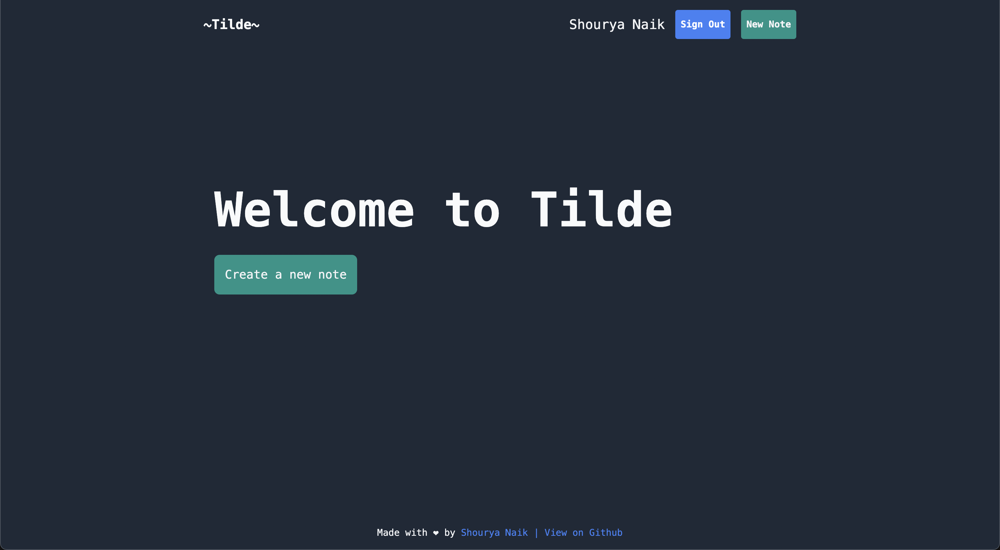
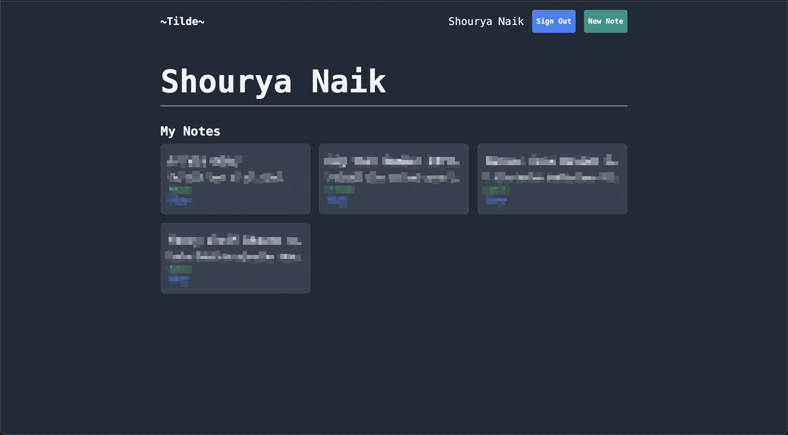
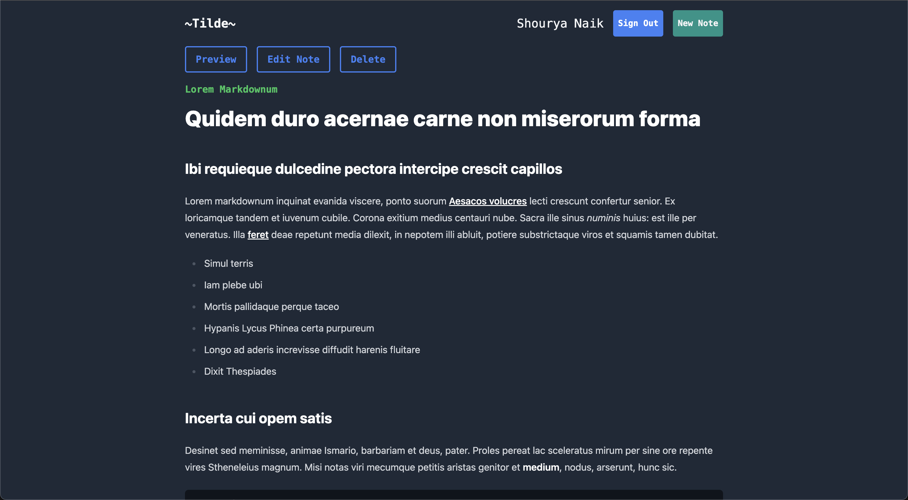

# Tilde



Tilde is a simple and beautiful Markdown note taking and sharing app. It's built using Next.js, React, and Tailwind CSS, with MongoDB as the database. It's also open source, so you can run your own instance of Tilde. Taking notes is as easy as logging in using your Github or Google account, and you can share your notes with anyone by simply sharing the link.

## Images



<br>



<br>

## Features

- Markdown support
- Secure login using Github or Google
- Easy note sharing
- Beautiful and no nonsense UI
- Open source and free to use
- Dark mode by default
- Private notes

## Future plans

- [ ] Add support for more authentication providers
- [ ] Add support for more themes
- [ ] Add support for more languages
- [ ] Syntax highlighting
- [ ] Export notes to PDF, HTML, or Markdown
- [ ] Add support for version control
- [ ] Add support for tags
- [ ] Add support for note templates
- [ ] Add support for collaborative notes

## Installation

- Clone the repository
- Install dependencies using `npm install`
- Create a `.env` file in the root directory and add the following variables:

```
MONGO_URI=<your_mongo_uri>
GITHUB_CLIENT_ID=<your_github_client_id>
GITHUB_CLIENT_SECRET=<your_github_client_secret>
GOOGLE_CLIENT_ID=<your_google_client_id>
GOOGLE_CLIENT_SECRET=<your_google_client_secret>
```

- Run the app using `npm run dev`
